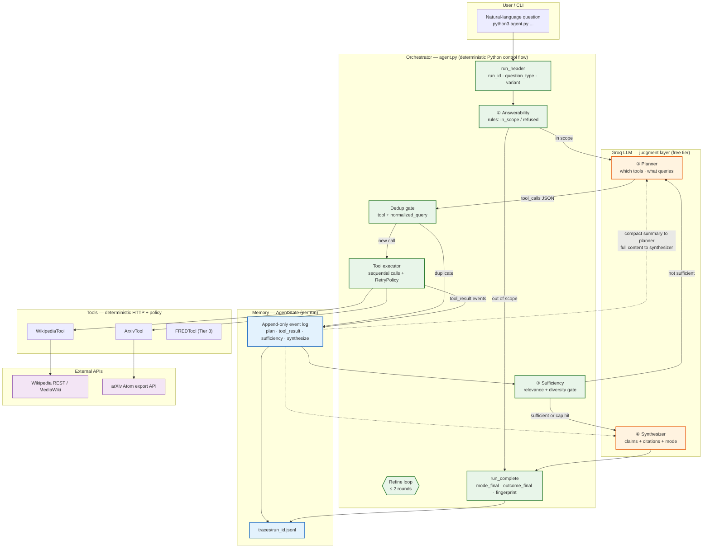

# TitanRAFA

Banking research agent: natural-language question → tool routing → cited answer with inspectable JSONL traces. **Python 3.12+**. Single-command run: `python3 agent.py "your question"`.

**Repository:** https://github.com/JasdeepSidhu13/TitanRAFA (public)  
**AI interaction log:** [`prompt-log.md`](prompt-log.md) (required, append-only)

---

## Deliverables checklist

| Requirement | Location |
|-------------|----------|
| Public GitHub repo | https://github.com/JasdeepSidhu13/TitanRAFA |
| Python solution | `agent.py`, `tools/`, `planner.py`, `synthesizer.py` |
| Single-command run | `python3 agent.py "your question"` |
| README (architecture, setup, performance, limitations) | this file |
| `prompt-log.md` (all AI interactions) | [`prompt-log.md`](prompt-log.md) |
| Runnable without paid API keys | **Live:** free [Groq API key](https://console.groq.com) (no payment). **Also:** `OFFLINE_MODE=1` fixture replay with zero keys (see below) |

---

## Architecture overview

From [`config/DESIGN.md`](config/DESIGN.md) — source of truth for design.

### Figure 1 — Full system architecture



**How to read the figure**

| # | Step | Who decides | What happens |
|---|------|-------------|--------------|
| ① | Answerability | **Rules** (no LLM) | Refuse out-of-scope questions (e.g. Q7) before any tool spend. |
| ② | Plan | **LLM** | Chooses tool(s) and queries from question + prior results summary. |
| — | Execute | **Code** | Dedup, rate limits, retries; tools never raise into the loop. |
| ③ | Sufficiency | **Rules** (no LLM) | Relevance per tool; diversity gate (≥2 tools) for cross-tool question types. |
| ④ | Synthesize | **LLM** | Grounded claims with `source_id` citations; enforces `mode_final`. |
| — | Trace | **Code** | Every step appended to `AgentState` → JSONL for inspection and Tier 2 diff. |

**Orange boxes = LLM judgment.** **Green boxes = deterministic orchestration and gates.** The LLM never executes tools or mutates state directly.

| Layer | Role |
|-------|------|
| **Orchestrator** | `agent.py` — plain Python control flow, not an LLM |
| **LLM (Groq)** | Planning and synthesis only; never executes tools or manages state |
| **Tools** | `WikipediaTool`, `ArxivTool` (Tier 1–2); `FREDTool` planned (Tier 3) |
| **Memory** | `AgentState` — append-only event log per run (`traces/{run_id}.jsonl`) |

Each run writes a JSONL trace: `run_header` → plan / tool_result / sufficiency / synthesize events → `run_complete` with `mode_final`, `outcome_final`, and `evidence_fingerprint`.

---

## Key design decisions

1. **ReAct-lite over explicit `AgentState` (not FSM, not full ReAct)** — I chose this over a finite-state machine (FSM) because a fully deterministic routing system would not generalize well across varied natural-language questions. I still wanted the LLM for **judgment** — deciding which tools to call and how to synthesize evidence — while keeping execution, gates, dedup, and tracing **deterministic in code**. Full text-based ReAct (Thought/Action/Observation parsed from free-form strings) would require many extra LLM round-trips and is fragile to parse; **ReAct-lite** was the pragmatic middle ground: structured `plan` events from the LLM, everything else executed and validated by Python. That split gave me a judgment layer without the time cost of multi-step conversational ReAct.

2. **Groq free tier over local models** — deterministic for reviewers on unknown hardware; requires a free `GROQ_API_KEY` (no payment, not a paid API). Documented in `.env.example`. This is the **primary live path** for running the agent on real questions.

3. **Deterministic sufficiency gate (not LLM)** — relevance by tool-specific rules; **source diversity gate** requires ≥2 distinct tools for `multi_source_synthesis` / `cross_tool_synthesis`; `data_retrieval` requires a registered data tool (FRED, not yet wired).

4. **Stable citations** — every successful retrieval gets a `source_id` (e.g. `wikipedia:Discount_window`, `arxiv:2007.15419v1`); synthesizer claims reference `source_id`, not free text.

5. **Dedup before every tool call** — `(tool_name, normalized_query)` checked against prior events; blocks logged as `dedup_skip`, not silently dropped.

6. **Per-tool `RetryPolicy`** — rate limits, timeouts, exponential backoff, and `Retry-After` handling in `config/tool_policy.yaml` (foundations for Tier 3 degradation; not fully exercised end-to-end yet).

7. **Tier 2 A/B via trace metadata** — `variant` (`single_pass` \| `refine`), `experiment_id`, `refine_disabled` on `run_header` for auto-pairing without manual reconciliation.

8. **Offline mode (no API key at all)** — `OFFLINE_MODE=1` replays fixtures for CI and reviewers who cannot sign up for Groq; complements but does not replace the free-tier live path.

### Running without paid API keys

This agent does **not** require a paid API. Two supported paths:

| Path | API key | Use case |
|------|---------|----------|
| **Live (recommended)** | Free `GROQ_API_KEY` from [console.groq.com](https://console.groq.com) | Real Wikipedia + arXiv retrieval, Tier 1/2 batches |
| **Offline** | None — `OFFLINE_MODE=1` | Tests, CI, smoke runs without any signup |

Wikipedia and arXiv are public APIs with no key. Only the planner and synthesizer call Groq, and Groq's free tier is sufficient for development and evaluation runs documented in `outputs/`.

---

## Setup and run instructions

### Prerequisites

- **Python 3.12+**
- **Live runs:** free `GROQ_API_KEY` from [console.groq.com](https://console.groq.com)
- **Optional (Tier 3):** `FRED_API_KEY` — not wired yet

### Install

```bash
git clone https://github.com/JasdeepSidhu13/TitanRAFA.git
cd TitanRAFA
python3 -m venv .venv
source .venv/bin/activate
pip install -r requirements.txt
cp .env.example .env
# Edit .env: GROQ_API_KEY=gsk_...
```

### Single question (required entry point)

```bash
source .env
python3 agent.py "What is the Federal Reserve discount window?" \
  --question-ref Q1 --question-type single_source_factual
```

Stdout: **Answer**, **Citations**, `mode_final`, `outcome_final`, **Trace** path.

### Without any API key (offline / CI)

For zero-key runs only — not required if you have a free Groq key:

```bash
OFFLINE_MODE=1 python3 agent.py --offline "What is GDP?" \
  --question-type single_source_factual
```

### Batch runners

```bash
# Tier 1 — all 8 reference questions → outputs/tier1_results.md
source .env && python3 -m scripts.run_reference

# Tier 2 — Q4 & Q6 × single_pass vs refine → outputs/tier2_comparison.md
source .env && python3 tier2.py

# Smoke tests (no API key)
bash scripts/run_tier1.sh
python3 -m pytest tests/ -v   # 51 tests
```

---

## Agent performance summary

### Tier 1 — live batch (`tier1-20260815-ua-fix`)

Full table: [`outputs/tier1_results.md`](outputs/tier1_results.md) · 8 traces under `traces/`

| Q | question_type | mode_final | outcome_final | tools_used |
|---|---------------|------------|---------------|------------|
| Q1 | single_source_factual | grounded | completed | wikipedia |
| Q2 | single_source_factual | grounded | completed | arxiv, wikipedia |
| Q3 | academic_search | grounded | completed | arxiv, wikipedia |
| Q4 | multi_source_synthesis | caveated | **completed** | arxiv, wikipedia |
| Q5 | data_retrieval | caveated | insufficient_evidence | arxiv, wikipedia (no FRED) |
| Q6 | cross_tool_synthesis | caveated | insufficient_evidence | wikipedia only (pre-fix arXiv) |
| Q7 | out_of_scope | refused | out_of_scope | none |
| Q8 | speculative | caveated | completed | arxiv |

**Post-fix spot-check (Q1 only, not full re-verification):** planner routed **wikipedia only** → `completed`, 2 Groq calls (`traces/0396332b-…`).

### Tier 2 — live paired runs (`tier2-live-20260815-rerun`)

Full report: [`outputs/tier2_comparison.md`](outputs/tier2_comparison.md)

| Q | variant | mode_final | outcome_final | tools_used | Groq |
|---|---------|------------|---------------|------------|------|
| **Q4** | single_pass | caveated | **completed** | arxiv, wikipedia | 2 |
| **Q4** | refine | caveated | **completed** | arxiv, wikipedia | 2 |
| Q6 | single_pass | caveated | insufficient_evidence | wikipedia | 3 |
| Q6 | refine | caveated | insufficient_evidence | wikipedia | 5 |

**Q4 proof point:** both variants pass the diversity gate on round 0 with multi-tool evidence; refine adds no extra plan cycles.

**Post-fix Q6 spot-check (refine, once):** `grounded` / **completed** / `arxiv + wikipedia` / 2 Groq (`traces/55b889f3-…`) after `prepare_arxiv_search_query()` fix.

---

## Honest limitations

- **LLM planner is non-deterministic** — prompt rules reduce mis-routing (e.g. single-tool for `single_source_factual`) but do not hard-enforce it in code.
- **arXiv rate limits** — full live batches are slow; cross-process rate state exists (`tools/rate_limit.py`) but Tier 3-style degradation paths are incomplete.
- **FRED not implemented** — Q5 (`data_retrieval`) cannot pass sufficiency until `FREDTool` is registered.
- **Post-fix verification was spot-check only** — Q1 and Q6 re-run individually; full Tier 1/Tier 2 batch re-verification not completed due to time.
- **Tier 2 file mixes pre- and post-fix Q6 rows** — see spot-check section at top of `outputs/tier2_comparison.md`.

---

## What I'd do with more time

1. **More comprehensive routing check and verification** — systematic eval of planner tool-choice across all `question_type` tags (not just spot-checks), with trace-level assertions on `tool_calls_proposed` vs expected routing matrix.

2. **Tier 3 Option 2 — deeper resilience** — build on existing `RetryPolicy` / rate-limit store in `config/tool_policy.yaml`: graceful degradation (`outcome_final=degraded`), exponential backoff tuning, `Retry-After` propagation, run-timeout budgeting, and Groq retry exhaustion handling end-to-end.

3. **FRED API tool** — implement `FREDTool` so Q5 and other `data_retrieval` questions return live macro series instead of `insufficient_evidence`.

4. **Evals with additional questions (Option A, tracked in Tier 3)** — expand `config/reference_questions.md` with held-out eval set; batch runner + comparison tooling to track regression on routing, sufficiency, and citation quality over time.

---

## Configuration reference

| File | Purpose |
|------|---------|
| [`config/DESIGN.md`](config/DESIGN.md) | Architecture source of truth |
| [`config/reference_questions.md`](config/reference_questions.md) | Q1–Q8 + `question_type` tags |
| [`config/tool_policy.yaml`](config/tool_policy.yaml) | Retry, rate limits, loop bounds |
| [`prompt-log.md`](prompt-log.md) | Complete AI tool interaction log |

## Traces

Each run: `traces/{run_id}.jsonl` — first line `run_header`, last line `run_complete` with `evidence_fingerprint.tools_used` and `source_ids`.
